#La ensalada con gracia - TPV

  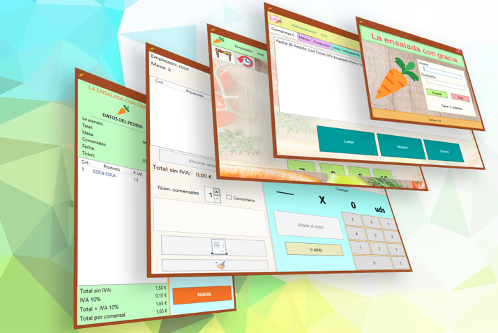

##Introducción

Este proyecto es una solución informática para el ciclo formativo de desarrollo de aplicaciones multiplataformas del IES Pere Maria Orts & Bosch de Benidorm, en dicha solución se busca atender a las necesidades diarias de un restaurante en lo tocante a la gestión de pedidos que pueden tomar lugar en diferentes mesas a la vez y a la manipulación de los datos generados por esta interacción.

##Objetivo

Para ello se hace uso de tecnologías como NodeJs, XAML y MariaDB, junto a entornos de desarrollo como Visual Studio Community 2019, HeidiSQL y Visual Studio Code para crear las diferentes capas que componen el software.

El TPV posee dos zonas claramente diferenciadas, la zona de administrador y la de empleado.

En la zona de administrador podremos listar el registro tablas; además podemos mostrar, actualizar o eliminar registros; al finalizar, el administrador puede abrir la zona de empleados para seguir trabajando como un empleado más; En el caso de que el usuario no poseyera las credenciales de administrador se dirigiría directamente  a la zona de empleados.

  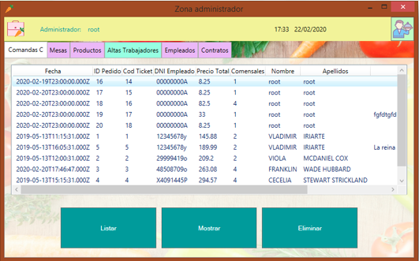

En la zona empleados los trabajadores tienen dos pestañas, en la primera se generan las mesas en base a la información almacenada en la base de datos y en la segunda los trabajadores pueden consultar información referente a las comandas ya despachadas.

  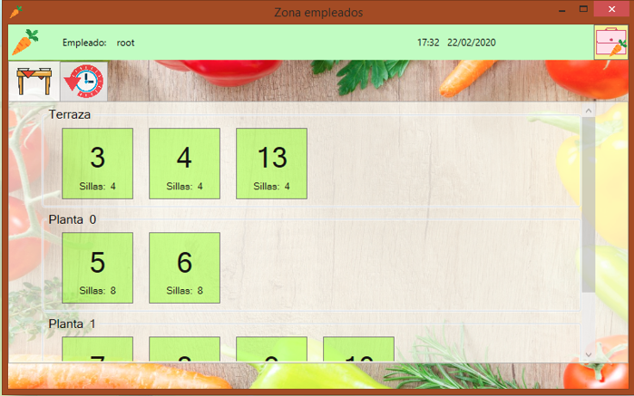

El trabajador, al presionar en uno de los botones de mesa, abre una ventana de diálogo en la cual se muestran los productos activos.

  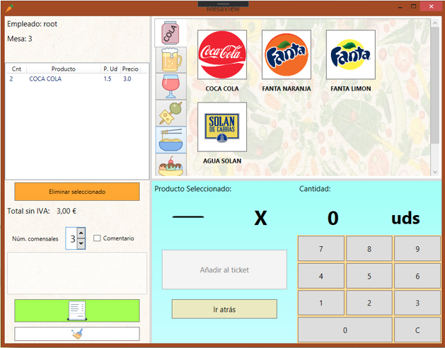

Para añadir un producto al ticket el empleado navega por las pestañas de categorías (bebidas, cerveza, vinos...etc.) y presionando en este lo selecciona. 
El ícono correspondiente al producto se muestra en la parte inferior, dónde se procederá a asignarle la cantidad a añadir al ticket. El usuario, a su vez, puede rectificar pulsando en el botón de “Eliminar seleccionado” o incluso vaciar todas las líneas presionando el botón de  impieza. Mientras el listado permanezca vació, la mesa aparecerá como libre. 

##Funcionalidades extras añadidas
###1-
Cuando los clientes se disponen a pagar la cuenta, el trabajador pulsa el botón verde de expender ticket de la ventana anterior para acceder a la  ventana de Proceso de pago, en ella aparece resumido todos los datos generados por los clientes con un desglose de la cantidad a pagar.

  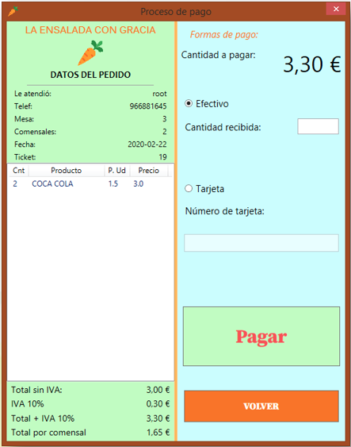

El  cliente puede elegir pagar con efectivo o con tarjeta(no implementado), después del pago se abrirá una ventana informativa mostrando el vuelto.  

###2-
Al tratarse de un cliente para una base de datos, el programa ofrece la posibilidad de introducir la dirección http del servidor del restaurante desde la ventana de opciones. 

  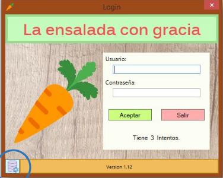

  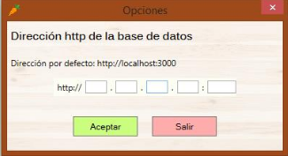

Debido a que es una función que solo los usuarios más experimentados van utilizar, se dispuso el botón en una esquina para simplificar la vista  de la pantalla de Login.

###3-
En la pestaña historial, los empleados pueden consultar las comandas expendidas, si se seleccionan y se pulsa sobre el botón con el símbolo de un archivo, pueden consultar las líneas pedidos.

  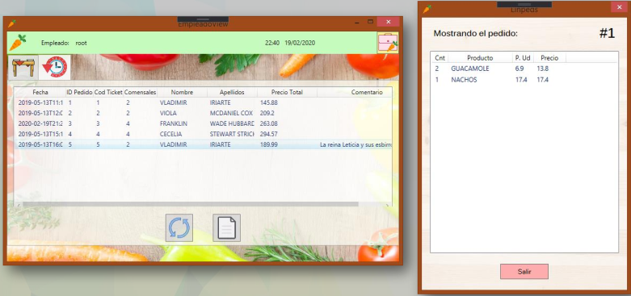

###4-
Otra función incorporada es la de que, si el empleado es administrador, puede volver tantas veces quiera a la zona administrador pulsando el botón
de la barra de información. Al pasar a la vista administrador, las comandas abiertas se almacenan en la sesión de empleados  haciéndolas accesibles cuando el encargado vuelva a la ventana de Zona empleados.  Para evitar perdida de información, desde la zona empleados, nos pedirá una  segunda confirmación en el caso de que se cierre la ventana con comandas aún abiertas. Lo mismo sucederá si desde administrador se ha accedido a la zona de empleados.

#Modelo de la base de datos

  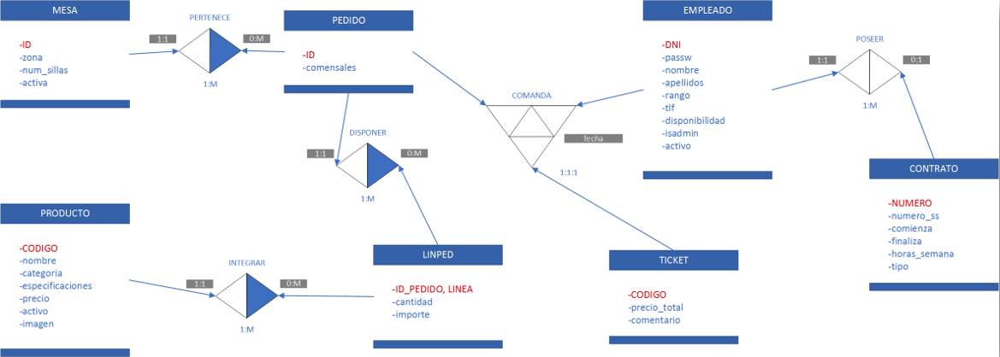

  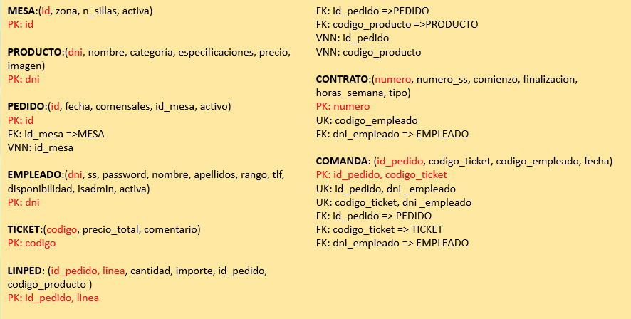

#Conclusiones del proyecto
En lo que respecta al funcionamiento de este, en un principio se concibió solo como un punto de cobro en el que el empleado, tras recibir la petición de pago por parte del cliente, introduciría los datos escritos en su bloc de comandas y efectuaría el cobro. Después de que lo requisitos mínimos del proyecto fuesen actualizados, se añadió a la lista de funcionalidades el que se pueda conservar pedidos abiertos y actualizables para todas las mesas con el fin de cumplir dicho requisito.

  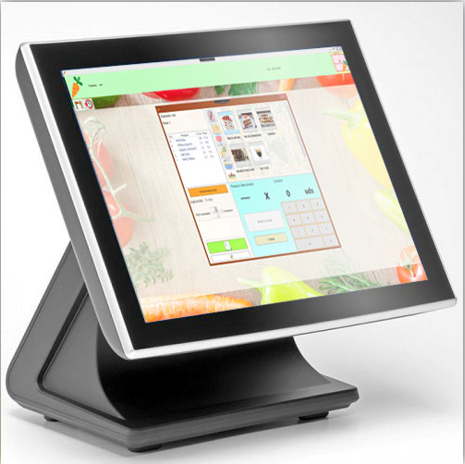

